# Preview版本 不代表最终品质 请静等更新
# 自制省钱高性价比maimaiDX触屏控制器新版教程
## 与旧版的比较
1. 采用最新做法编写新教程，采用最新的研究成果，与最前沿的思路
2. 新版走线方式，干扰更少，性能更高
3. 简化制作步骤，制作更美观
4. 将教学群内教学内容和文章结合，配合大家曾经提出的问题加以细致解释，避免困惑
5. 也许以后标题会改成"自制省钱高性价比maimaiDX全套控制器新版教程"
6. 添加过程图片和更多的原理解释


~~旧版文档相当落后没有更新，内部做法很多已经弃用，非常丢人，非常乱~~   


**本教程着重关注触屏这一部分，对于按键，固定结构等并不关注，也不提供教程，后续可能会加，但是不要期望现在的以下内容会有结构，按键，屏幕之类的内容，更不会提供任何关于游戏软件的任何支持**  
**目前着重更新主要内容部分，对于协力者感谢，版权声明和一些公告，一些注意事项，一些会大概率导致失败的制作细节反例，请参阅旧版教程！！！（在上面代码那块里面）**
**本文章硬件部分制作完全原创，若有类似，可能是平行互不干扰的项目**
**程序部分是基于已有开源项目经过调试参数数周修改得到，并非直接搬用，可以自行查阅代码，很多部分不一样**
## 第一部分 总览

本作品旨在弄个便宜好用的方案，让大多数人都可以轻松把这个东西做出来，同时不要效果差到没法玩。
新教程的思路是引导思考，提出不同做法来比较，让您自行选择自己喜欢的做法去做  

**[成功作品展示]**

Under Wrinting
Todo:Add pictures

**以下说法是个人定义，配合解释，可能对很多人不适用，自行判断哦！** 
**以下说法仅适用于触屏部分在完全按照要求**  
难度：**一般**    
```
**不对所有人制作难度做保证，以下内容为对部分人来说制作难度的一种参考**
**每个人的实现都不一样，每个人买到的材料也不一样，每个人成功与否，效果好不好肯定也不一样**
其实触屏这块制作已经被简化了很多，改进了很多，
旧版教程很多东西都已经弃用，此新版做法相当好理解，
我认为对于16岁以上有耐心的大部分人都可以完成，
其中最要求严格的就是裁切和贴装ito膜，要求严格的精确，
其他部分，就【触屏这块触摸面板部分】而言，
已经没有任何难度，不需要特别多的思考。
几乎不需要有代码能力，代码开箱即用，
只需要调整少量阈值即可。
按照教程严格规范制作，目前未见有人失败
有失败或者教程很差的，可以看看他们的不听话，触摸区块裁的歪歪扭扭，
贴的一边近一边远，根本不按要求来，不按照教程要求来，这失败本教程不背锅
```  

成本：**按照已有工具情况下计算较低**
```
就这样说吧，43寸触摸面板（不算按键，固定什么的，只算这块玻璃和旁边木板）
有工具的话500元以内就可以搞定了，省着些，细心些，避免浪费，可能三四百就结束了
```

耗时：**可能较长**
```
快递很慢是主要原因。
其次虽然操作都简单，但是裁切，贴装，引线，都是大量重复简单事情，
所以虽然简单，都是需要耐心，耗费时间可能较多一些
```
效果：**大概是目前来说最好的自制法了吧，已测试一般运行，打歌没有啥问题，
主要是自制的玩家好像技术都是中等级别，主要是没大爹测试，测不到性能极限（现在受限本方案测试的玩家个人水平，在官方机台也无法打出更好成绩，更无法测试自制台上限，故目前本方案上限未知，并非方案自身有问题）**
```
**不对制作效果做保证，以下内容为对制作效果的一种参考**
**每个人的实现都不一样，每个人买到的材料也不一样，每个人成功与否，效果好不好肯定也不一样**
感应，手套触摸各方面都没有问题。
两位佬说，触摸灵敏度优于他们那边的机台
一位佬说，触摸灵敏度没有达到官机一根手指直立也能稳定感应的那么厉害
延迟，刷新率按照理论计算理论上优于机台上那块触摸面板
但是对于虚空触发（手不放上去，也会有自动点击的现象），
根据每个人做的不一样，显示器发出的干扰不一样，还是有一些的。
好像43寸这种情况，大约几分钟内分钟有个一下两下的？
虽然可能会少量影响心情，但是佬们表示好像并不影响打歌？
32寸以及32寸以下，这种情况好像没听说过有
并且虚空触发好像在经常触摸屏幕的情况下，会变少很多，或者几乎不发生
所以按照这样，打歌过程中应该是不会有影响的
```

## 第二部分 注意事项和声明
Under Wrinting

**本教程仅仅为了以下目的：**
1. 不为追求完美的外观
2. 不为追求完美无缺的使用体验
3. 不为追求每个人都必须成功
4. 不追求绝对的高性能，做到基本13+能够正常打，再高性能不做保证（目前有用本方案14+ S评级的验证，受限于游玩者个人水平，目前无法确认最高性能在哪里（他在官机上也无法完成更高成绩））
5. 在成本低，难度低的情况下做出一个**能用**的基本触摸面板
6. 故高价定制蚀刻面板等操作，不在本项目讨论范围内
7. 判定精准>美观性 我们不会为了美观而做某些方案触摸到漂亮的分区走线就会导致区块触发的蹭的方案，我们认为还原判定比美观要好

### 不保证每个人都能成功，失败或者效果差与本教程无关
本教程并非最好做法，只是万千做法的其中一个而已，如果你有更好的思路，欢迎分享出来帮助大家！（而非觉得自己很厉害就来喷这个方案，你很厉害可以发出来造福大家啊，而不是完全闭源，诶，我比你厉害，我比你好，但是就是不发，自己想想真正需要方案的玩家会赞同你吗，大家支持的是能帮助到大家的人，把方案开源，分享思路，推动进步，人人支持！）  
我们的目的是为玩不到的玩家能玩到，并非自己做一个就不用去游戏厅花钱，若有游戏厅近，请支持官方机台。

## 第三部分 对于现在不同触屏大方向的对比
目前主流做法有以下几种：

1. 红外触屏框
2. 普通多点触控电容屏
3. 分区触控电容屏（与官方相同的实现方法）

以下进行对比

#### 1. 红外触屏
采用横竖摆放大量红外对射LED和接收管的方式，依据光在均匀介质中沿直线传播的特点，手穿过光线，主控检测到阻挡后就会判断已经触摸上。
缺点：因为需要巨量的轮询xy轴相当多的接收管状态，此类屏幕一般延迟较高；因为是挡光形式的，设想两只手斜着平行放入触摸区域，因为挡光的问题，会被错误的识别，因而造成无法正常触发的问题；由于反馈给电脑，一整个大手上去会被识别成手中心一个触摸点，故只有中心位置一个区块会触发，造成严重的一个吃，特别是一些邪道不能用，不能糊，要避免，必须要用分离的手指打歌，并指都可能出问题。走普通hid触摸协议，windows下会显示触摸点，长按会出框右键等。
优点：凡不能透光的物体都能触发，根本不担心手套触摸；此类触摸框相当便宜，43寸也就四百以下？不仅可以用于mai，也可以用于其他地方。
改进：红外框具有读取触摸点长宽的能力，如果能把这点用好，就能基本估算手完全遮挡哪些区块，避免吃的现象发生（类似希沃、东方中原白板板擦识别功能）此思路目前未见有人做
由于目前延迟，吃，不能手掌多方面问题，我认为这不是三个方法中最好的方法。
#### 2. 普通多点触控电容屏
（跟现在普通手机或者平板触摸屏是一个东西）  
~~没有详细了解过具体原理，以下是猜的~~  
大概是横竖许多条触摸条，同样通过xy双方向读取，与红外不同的是，此操作没有跟红外一样一挡光就全没了这种，所以各触摸点互不影响。同样，此方法触摸条不多，轮询较快，延迟低。
缺点：一个大触摸点类似手掌上去，最离谱的情况下也是会被认为是一个触摸点，跟红外一样，手掌覆盖的所有区块不能全部触发，因此跟红外一样会有一个严重的吃，特别是一些邪道不能用，不能糊，要避免，必须要用分离的手指打歌，并指都可能出问题。另外市售成品电容触摸外屏可能对手套触摸的支持存疑。价格可能较高。走普通hid触摸协议，windows下会显示触摸点，长按会出框右键等。
优点：延迟较低，不仅可以用于mai，也可以用于其他地方。不会受类似红外遮挡就挂的影响。
改进：部分电容屏幕也具有读取触摸点形状和大小的能力，虽然一个异形物体只会被识别成一个触摸点，但是实际上数据里面是有具体形状大小的，如果能把这点用好，就能大概计算手完全遮挡哪些区块，类似android9彩蛋画图，不过那个用的是电容屏压力感应功能，大差不差，如果你有LG G8（？不记得了），开发者模式打开触摸点显示那一类的，用手指换着接触面形状点击屏幕，可以看到屏幕对于触摸点形状大小的描绘，如果你有surface，打开surface诊断工具，到触摸点个数那块，也能体验到电容触屏对于形状大小识别方面的效果。
由于目前吃，不能手掌，手套可能不行多方面问题，我认为这不是三个方法中最好的方法。
#### 2. 区块触摸电容触屏方案
**目前认为是官方机台采用的方案**  
缺点：没有现成售卖的低价成品，要低价实现，必须自己做，根据方案不同，可能存在不同的缺点，因此此处无法描述，但是吃之类的，不能邪道之类的缺点全无，大多都能做到官机体验，完全一样的判定等。只有区块可以触摸，不能用作普通触屏使用。一般需要距离显示屏一小段距离才能正常工作
优点：走原生通道，不经过windows触摸，没有显示触摸点，右键等奇葩情况。一般延迟极低。手接触到的区块全部可以同时触发。可以使用跟官方机台一样的手法，操作，不吃，可糊。价格低。官方类似实现方案。可用、灵敏的手套触摸
由于跟官方机台手感，手法可用一致，延迟低，手套触摸，我认为这不是三个方法中最好的方法。
**以下制作就是我自己思路自行设计的区块电容触摸方案，只有这一个，红外的，普通电容的，这里不教，也没什么好教的，那些到手即用**


每日怨言  


## 第四部分 区块电容触摸屏设计总览
**本部分目的：使读者明白总体结构，明白个大概，更好地理解制作难度，选择做还是不做；使读者知道整个基本框架是什么样子，大概都有什么部分；使读者知道大概需要什么材料，为下一部分的选材做铺垫**

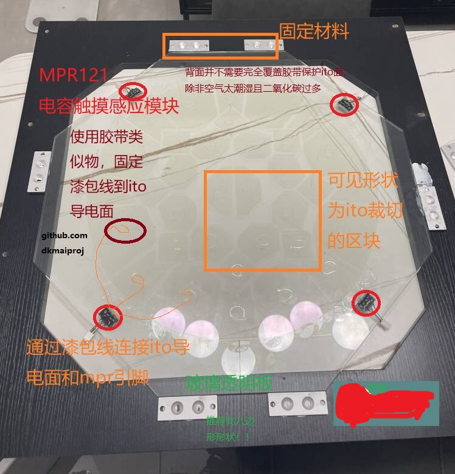
**从上图可以看出，整体触摸面板结构还是非常简单的！**
（~~删除线~~内容是新教程Preview版本编写时候写了又感觉不合适删减了的内容，留做参考但是主要内容一定会有新写法替代删除的内容而且写得更好，所以这部分内容一般选择直接跳过为好）
~~**同时可以看出，需要的材料基本有以下内容：**~~
~~1. ITO导电膜（**单面带胶**（重要！！！我自己当时贪便宜没有带胶，回来自己上胶非常困难和丑，很难把厚度掌控好，很累很累，做出来非常难看！！））~~
~~2. 漆包线~~
~~3. mpr121模块 3-4 个（总共34个区块8A8B2C8D8E，每个mpr121从0-11共12个触摸点支持，故最少3个mpr足够，为了走线布线好走，目前大多选择4个）~~
~~4. 固定漆包线到ito导电面的材料~~
~~5. 透明板一块，建议正八边形，也可以自己选择，但是圆形很少有人用（难以固定）~~
~~6. 普通连接线，连接mpr模块和单片机开发板（不在图片内）~~
~~7. 单片机开发板~~

~~**显然还需要很多工具对吧  ~~
~~焊接系列**~~
~~1. 调温电烙铁~~
~~2. 焊锡丝~~
~~3. 助焊剂（重要！！）~~
~~4.（可选）维护/辅助用的工具，如高温海绵，吸锡带之类的焊接辅助用具~~
   
~~**其他工具**~~ 
~~1. 去除漆包线漆皮用的工具~~
~~2. 螺丝刀等固定用的工具~~

~~特殊工具~~  
~~部分先进做法如[自行蚀刻法]将会使用，暂时没有编写完对应做法，于是这里暂时不编写~~

**从此部分开始,因为现在可选做法很多，就一个区块引出就有好几种做法，每种做法所用材料不同，步骤不同，故以下内容每一章节会有多个分支，请注意选择自己需要的哪一个分支**

我们可以看出整体分为以下几个部分
1. 导电区块
2. 区块引出
3. 区块引出线固定
4. 触摸检测模块
5. 主控单片机（图中未拍到）
6. 基层透明板
7. 固定材料和大底板

以上所示内容现在有多种实现方式，故**现在展示主要划分，下文对每种做法详细说明，并教你如何选材**。因为实现方式不同，需要准备的材料也不同，故这里并不会说明具体材料，只有个大概。

## 第五部分 实现方式和材料选择选型指南

**针对上文提出的七个部分，分别讨论具体实现方式和选材方向**
**注意，部分做法是可选择性的，例如可以这一步选择A做法下一步选择B做法，自由组合，但是也有做法是一路到底的，例如这一步选择C做法以后所有都要选C来配合了**
### 1. 导电区块

导电区块说的是对于分区电容的一共34个区块，怎么实现让这几个区块导电且透明和怎么实现区块形状大小的限定

主要解决的是：
1. A用什么材料实现能导电还能透光
2. B怎么做出所需形状的导电区块

目前的主要实现方法：

首先我们知道，我们需要导电的区块依然透光能看见屏幕上面显示的什么。首先就是这种材料应该怎么选择，我搜集到的有以下方式
#### 1. 导线画圈法（外源（看到别人这样做过，非本人思路））

使用导电的线打圈制成类似一个面的形态，同时因为线间距大，可以透过光线，还可以看到屏幕  
A: 使用导线画圈，既导电还透光
B: 画不同的外轮廓实现不同形状  
**理论可行，虽然没有已知测试证明此方法真的成功可用**
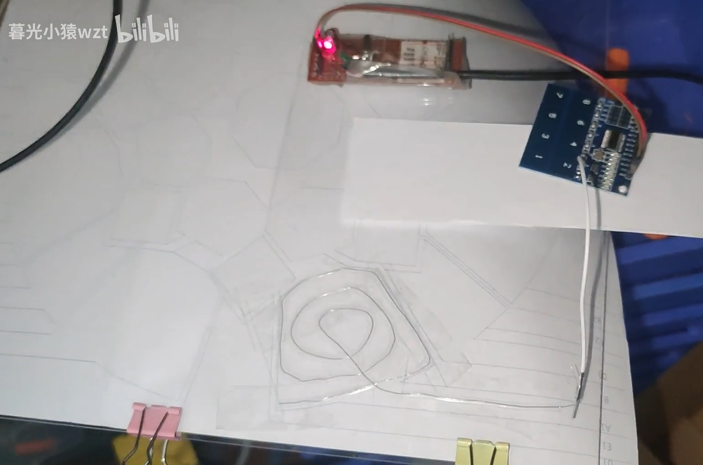

成本：接近0  
外观：不是很好看  
成功率：未知  
灵敏度：未知  
难度：看起来很简单
**本方案并非来自我团队设计或已经试验可行，故下文不会支持**
#### 2. ITO裁切法
~~鄙人自己想出来的做法~~

有一种东西叫做ITO导电膜，是在塑料离型膜上面做了一层氧化铟锡来导电，他基材是塑料非常便于裁切，透光性极佳，只有一点点微黄色忽略不计，成为我最开始选材时候找到的评估后觉得最好的材料

A: ITO导电膜，既导电还透光
B: 通过直接裁剪获取不同形状  

通过裁切导电膜获取对应的单片区块


成本：便宜  
外观：还好还好  
成功率：只要细心裁切准确，成功率相当高  
灵敏度：很好  
难度：细心细心就很简单！！剪纸而已嘛

材料选型方向：

对于ITO膜的选择，目前大概只有俩问题  
带胶还是不带胶？买多少方阻的？

带胶是一定要带胶的，怎么说都要带胶的，带胶膜好用又舒心（（（    
方阻目前测试150欧姆以下的均可，再大没有测试过。  
据说4？张A4的ITO就足够，应该是45元*4 差不多吧，但是其实如果可以的话，可以这样来操作，可以便宜一些
如图：

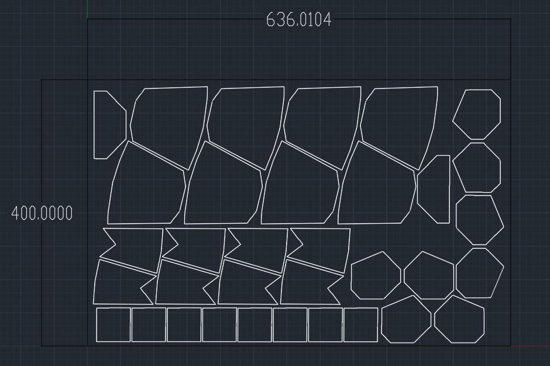

ito膜一般都是$406mm宽度*裁切长度$，如果店家支持自定义长度，那么按照图片的摆放方式，使用约95元即可实现所有区块，按照道理来讲，可以三人合购一张等效1平方米的（$406*2463$）,然后理论上可以裁出3.8套43寸台用区块，按照3来计算，每人均价86元！！


**ITO裁切法在下方引线处会分成两个类型来讲**

#### 3. ITO自制蚀刻法
目前认为此方法如果真的做了完整的43寸大小这将是自制触摸最优解  
在此这里提一嘴定制蚀刻法
**定制蚀刻法**
通过在一片60x60左右大小的玻璃或ITO膜上，让工厂在上方预先做好分区和走线，这样完全没有裁切痕迹，也没有下2.区块引出的线的痕迹，非常漂亮，官方和某商业台大概是这样的做法，也有可能是磁控溅射，反正就是这一类工厂定制形式。
定制成本：**打样一片8000+**
根据本项目的目的，直接否决，成本难以接受
**但是将分区和走线直接蚀刻好来达到这个完美的效果就只有这一种方法吗，我们要不要...**
联想在pcb打样巨贵没有现在JLC的价格的时候，我们要用pcb是怎么制作的呢...是不是，可以迁移运用一下...  
参见 [思路引出](https://www.bilibili.com/video/BV1hV4y1r7ZV)
**注意，请勿在非相关场合提及非相关内容，例如在我的其他视频底下谈论音游相关，或者在与音游无关的群因为我的存在而提起我在音游方面的项目，这真的会让在这些无关场合下其他人感到困惑和不解**

此方案只做了三个区块的验证，主要是作者实在贫穷，做实验的ITO膜还是群里的佬送的，工具是赞助的...
于是**此方案仅经过少量验证，未做一个大的完整的来验证**
**此思路完全原创！！！！！**
**图片里面的蚀刻已经接mpr121测试通过！**
**此方法为试验期，下述教程可能在开始编写时不包括自制蚀刻的具体教程内容**

提示：ITO膜不只有$406*length$一种，还有$1250*length$，两人合购$1250*600$，再裁开$2 * 625*600$（（（（ 

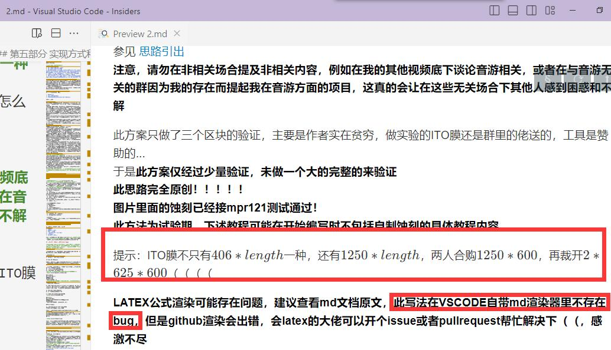

**LATEX公式渲染可能存在问题，建议查看md文档原文，此写法在VSCODE自带md渲染器里不存在bug，但是github渲染会出错，会latex的大佬可以开个issue或者pullrequest帮忙解决下（（，感激不尽**

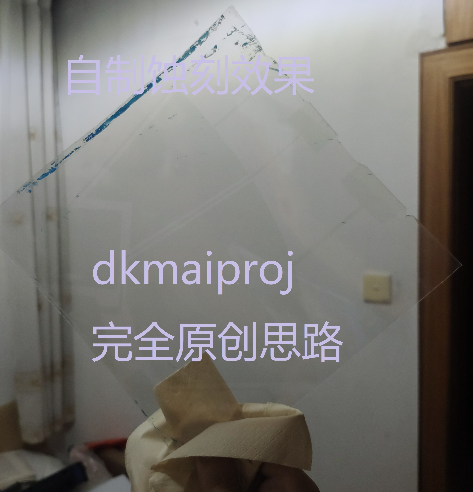

于是我们使用自制蚀刻法，

成本：单触摸屏带蚀刻工具共700内  
外观：顶级完美（不仔细对光看不出区块） 
成功率：未知  
灵敏度：很好  
难度：不难，弄明白就好
危险性*:需要戴手套操作化学试剂
*：只在此方案存在
todo

### 2. 区块引出

区块引出说的是对于已经划分出来的能导电的透明的区块，如何把区块引出到触摸面板边缘并连接触摸检测模块

目前大概也许好像是有三种比较常见的方法

主要解决的是：

A用什么材料导电
B怎么做的美观一些

目前大概也许有这三种办法  
**前两种对应前文ITO裁切法使用** 
**最后一种是ITO化学蚀刻法专属**

#### 漆包线引线法

**鄙人自己想的个人认为最简单的方法！**

使用漆包线进行引出，顾名思义
见下图（但是实际做的时候一定要理好线！）
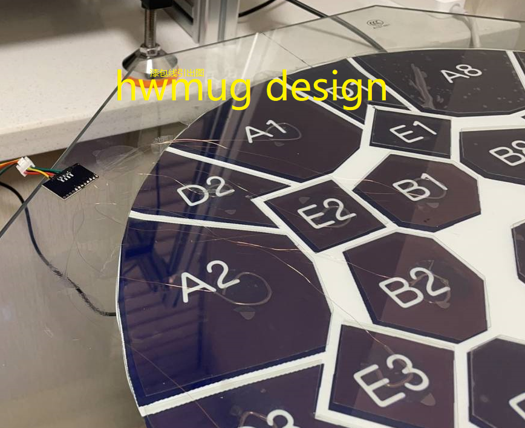

很简单对吧~（chuni企鹅）  

**漆包线选型：**

材质： 铜？铝？

考虑到漆包线本身很细且都会挡光，屏幕开启状态下都是一条细细的黑线，线本身是银色的还是黄色的都无所谓，为了焊接舒服，选择铜的为优（铝不沾锡）

粗细？
（以下内容来自设计群第一批成员自发整理，在此表示感谢）
（以下内容为设计群洛梨&苦鱼试验巨量漆包线得出，在此表示感谢）
较细的漆包线（**推荐使用 0.1 0.13mm**的规格，有信心可以选用 0.07mm）。
  - 最好一头，就是统一贴 ito 膜上的，用脱漆剂统一一次性脱漆多根。
    - **使用脱漆剂务必注意安全**！
    - 首次使用建议带好手套、口罩做好个人防护，**接触到皮肤会有灼烧感**。
    - 第一次打开有出现**内含气体而炸出一些的情况**，请知悉。
  - **0.13 的可以火烧退漆和打磨退漆**，不必使用脱漆剂，更方便。
  - 细的漆包线不是老司机，不能刮漆，需要脱漆剂，比较麻烦。

优点：
1. 超级无敌简单，操作非常容易！！
2. 成本巨低！！
3. 线可以随意放位置，自由自在，可以距离区块和触摸平面距离加大防止线上的感应

缺点：
1. 明线不可避免的会能看得见，但是对比43寸，它真的很小很小很小很小根本不会注意到 ``` （引用）你星星方向都看不清楚还看线 打歌的时候哪有精力看线```


#### ITO裁切带线法
（外源试验&思路平行）
在裁切ITO的时候不仅裁切一块区块，同时提前设计好走线并跟随ITO同时裁切出来

参见：


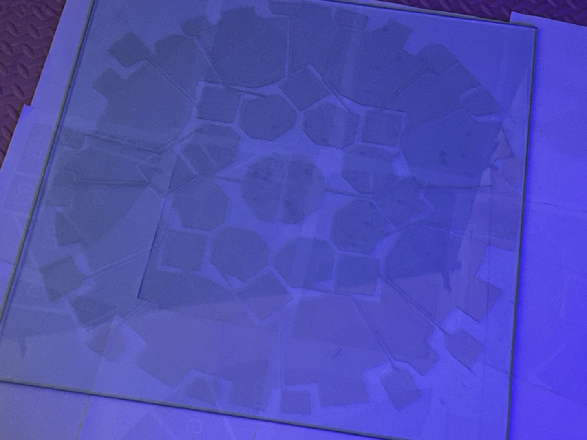
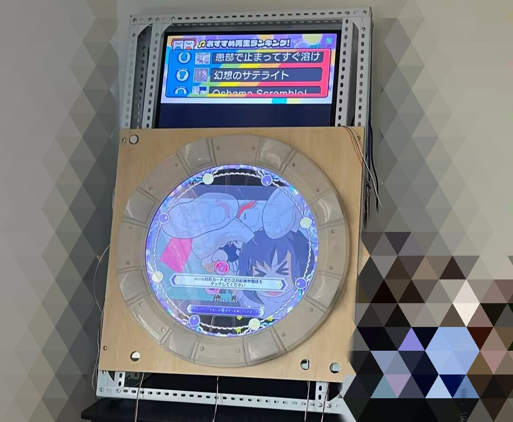

图片应该就很明白了


选型参考上文ITO选型，因为没有什么特别新加入材料，所以就没有专门的选型指南

优点：
1. 没有明线，线是ITO本身，是透明的，比较美观，接近蚀刻的效果，**非常漂亮**
2. 线本身就是带背胶的膜，所以不用考虑任何固定，不用任何额外的胶，没有胶痕很美观，也不用操心固定
3. 整体是平的，没有线的突起，如果采用实验性双层做法，玻璃盖在平面显然比玻璃盖在线上要好
4. 据说ITO膜折射率和一些UV紫外胶水很类似，如果缝隙填胶，有可能可以让膜边界和本体不可见，可能可以做出蚀刻的效果

缺点：
1. 做起来麻烦，膜裁细线需要非常细心
2. 不能跟上面一样排版区块，需要考虑线的存在，这样，ITO膜上可能要加100CNY左右成本
3. 依然有ITO裁切边界的痕迹，没有做到蚀刻那种完全完美

#### 蚀刻线
一个非常显然的结论是跟上面区块一起蚀刻出来就好了
优缺点跟上面那个区块蚀刻是一起的


### 3. 区块引出线固定

区块引出线固定说的是对于上述区块引出方式，若使用线等材料，怎么与导电区块间接触固定的实现方法

只有漆包线需要固定，膜线和蚀刻都没有这个需求

主要解决的是：

A用什么材料固定，还要透明

**注：目前还没找到完全无痕的固定方式**

#### 透明胶带
老少皆宜，非常好理解对吧（（
不需要外加任何说明的简单

选型：
只要不是太差的胶带都可以，别自己掉了那种就行（（
买透明度高的，无色的会好看一些吧

优点：
1. 肉眼可见的简单
2. 便宜

缺点：
1. 裁切透明胶容易出现胶痕而且切透明胶还是有点麻烦
2. 透明胶普遍不是粘性特别特别高到不活动那种，有可能造成微量接触不良？
3. 美观度可能稍微有点..不过还是那句话``` （引用）你星星方向都看不清楚还看线 打歌的时候哪有精力看线``` 胶带也差不多，更何况透明

#### 进阶透明胶带

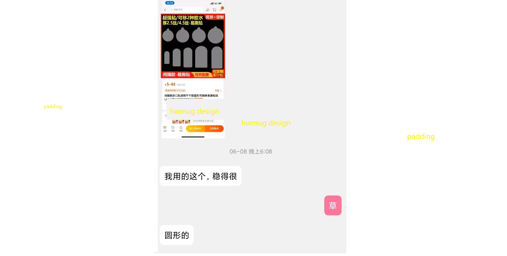

顾图思义
老少皆宜，非常好理解对吧（（
不需要外加任何说明的简单

优点：
1. 肉眼可见的简单
2. 便宜
3. 透明度高粘性强
4. 已经裁切好，无需二次裁切，没有胶痕，圆形观感好
5. 比普通透明胶稳固一些  
   
缺点：
1. 依然还是能看出来胶带，但是美观度已经好很多
2. 也许还是有那么一neinei的不稳？
#### UV胶法

顾名思义

啊，已经很多人做了但是都没有反馈回来具体选型和图片...只有告诉我，体验很好，很稳定..


优点：
1. 完全稳固

todo

### 4. 触摸检测模块

触摸检测模块是对于已经引出出来的区块，用什么模块/IC来对是否触摸做出检测并作为一定协议的信号与主控单片机通信

目前主要有以下选型

#### MPR 121 

价格：便宜  
灵敏度：好  
刷新率：好（与I2C速率有关，但是即使是最慢的读取方式，刷新率依然超过官方面板）  
延迟：低（低于官方面板（使用此方案制作，打歌可能出现FAST巨量，考虑在程序里面加个队列增加延迟来解决问题）  
生产状态：目前各大平台均有售卖，但是MPR121是已停产芯片  
每片支持的触摸点数：12  
总线： I2C
支持的地址切换数：4
电压（供电及IO）：3.3v
**严禁使用5v供电**


**目前大多数人使用的都是此方案**  
**本教程提供的所有程序均基于mpr121**


此方案附加内容，地址切换教程：

I2C总线通过地址分别不同设备，MPR121模块默认地址一般是0x5A，我们需要修改其他片的地址，让其工作在不同地址，这样才能一个单片机的一个总线连接多个MPR

ARDUINO生态 开发板I2C总线已连接设备地址列出工具：[i2cdetect(arduino library）](https://github.com/mcauser/i2cdetect)

1. 称取一片分析纯的MPR121
   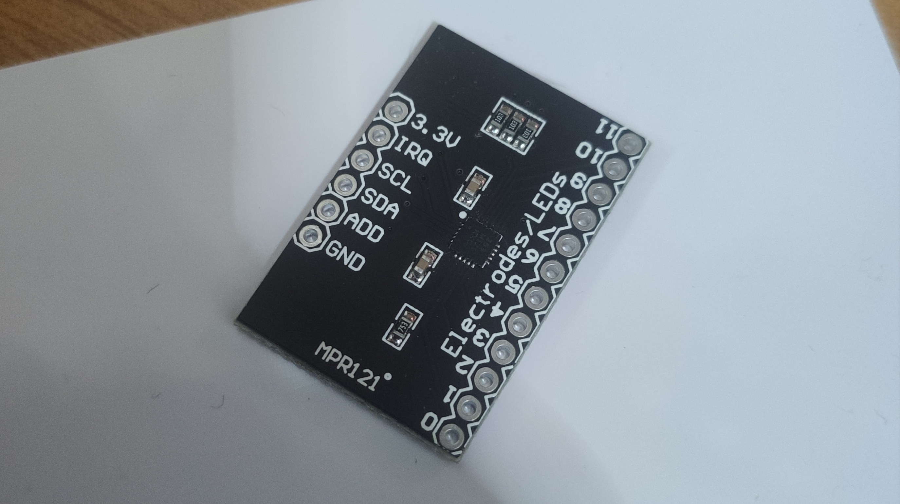
2. 翻到背面，切断ADD跳线，**务必保证切断同时不伤其他线路**
   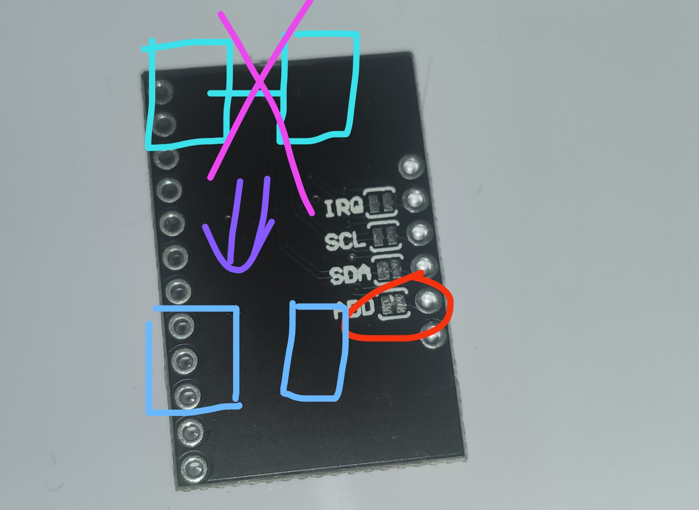
3. 正面焊点，ADD短接GND,VCC,SDA,SCL分别获得地址0x5A,0x5B,0x5C,0x5D

#### ILITEK 2117A0

**官方面板触摸IC**

目前用这个的且被我知道的仅有一人，无法提供足量信息

价格：？？  
灵敏度：官方同款IC  
刷新率：官方同款IC  
延迟：官方同款IC，但是不知道主控程序会不会影响
生产状态：目前国内各大平台均无售卖，需要海外代购，是否停产不知道  
每片支持的触摸点数：？？  
总线： I2C？
支持的地址切换数：不需要切换，一片IC电极总数已经足够
电压（供电及IO）：？？

#### 其他IC
市面上还有很多各种各样的触摸IC，但是出于都没试过，无法提供信息

#### 其他事项
1. 触摸优化： 据某大佬提供，在触摸IC提供的电极接口上串联适当的电阻（几十k到几百k），可组成LC滤波（但是感觉是说错了，应该是RC滤波），增加触摸的稳定性，减少虚空触发等问题。（官方面板有此操作）
2. 高速总线走线提倡等长原则，即同一片触摸IC模块连接主控的两根信号线应该完全等长，避免数据传输错误或者无法传输。
3. 本教程提供的程序对于mpr121的调教基本可以适配大多解决方案，但是依然有人（30%）反映少量区块存在虚空触发问题，有能力的大佬建议通过修改mprsetup里的参数，调节mpr适配自己的作品。


### 5. 主控单片机（图中未拍到）

主控单片机说的是对于触摸检测好的信号，转换成可以连接电脑的USB/串口信号等用的芯片/开发板

考虑的有以下几点
A 单片机性能，包括串口性能，I2C总线性能之类  
B 单片机电压（比如如果需要使用mpr121，则IO和供电电压需为3.3v）

#### 首先讨论串口  
**这部分可能非常难懂，以作者语文将近不及格的表达水平来讲解，可能更难懂，不明白的可以不看讲解部分，看加粗部分即可**
这东西对于只知道普通串口的人比较难以理解，还有部分人借所谓9600波特率太慢来抹黑本项目，只能说，这种人可能连这些串口的原理，或者正常传输的条件都不知道。

目前主要有两种，
##### 一是走usb转串口芯片，
转变为TTL等信号，再连接单片机，此方法一般延迟较大，但是波特率是满足的，但是经过测试会影响性能。
代表：Arduino Nano 、UNO等
**这个方案串口最高理论速度133.3333hz刷新率，延迟较高**
此方案讲解如下：

<details>
<summary>展开查看</summary>
<pre>

1. 电脑通过某种设备（板载RS232串口，USB转TTL串口（例如CH340））制造一个硬件串口，单片机一般自带硬件TTL串口
1. 双方通过串口控制信息初始化串口，包括波特率（传输速度），数据位x位，停止位x位等
2. 双方交叉连接，以预先被写死的串口控制信息传输串口数据信息，要求双方串口控制信息设置完全相同才能正常传输。不然假设一方以另外一方两倍的速度发送和接受，这边发两个bit那边在同样的时间接收一次，显然就会炸。

那么，游戏程序本身内定串口控制信息是9600的速度，游戏程序打开串口，初始化电脑端为9600波特率，电脑告诉串口设备以9600速度在那两条串口TXRX数据线上发送和接收串口数据信息，那么远端单片机就必须以9600去配合，双方才能正确的传输信息  
所以这个9600实际上是游戏程序限制的，s公司在开发这个设备的时候就确定了这个波特率，所以不管是官方面板还是自制面板一般都是要使用这个波特率的（为什么要说一般呢，因为见下USB-CDC）


**以下内容可能让您感到不适**

有的人说“打开程序一看就知道这个方案肯定不行，波特率才9600那么慢，还好意思发出来”这样，不知道是真的不懂还是忽悠不知道串口这玩意的玩家来抹黑这个方案的。
有本事你用这种走真实存在的串口两条线的串口，不修改游戏的前提下，做一个大于9600波特率的。
或者说，按照你的说法，9600波特率，就是方案不行，那官方面板9600波特率，官方面板官方机台肯定不行，刷新速度那么慢，打不了大歌，官机只能打打12以下的小歌，大歌1414+打不了（（（（（  
就这么说吧，如果程序里面以115200速度打开串口去配合游戏程序，就像你写了个串口通信的程序，单片机程序里是115200，然后电脑串口监视器以9600波特率传输...额，这，但凡接触过串口的都知道这样必挂吧..如果我都说到这份上了还要问“你有什么证据证明官方是9600”，“9600那么慢，官方肯定不是9600，你这9600肯定不行”，我已经没话说了。


</pre>
</details>

##### 二是USB-CDC串口，USB-CDC
代表：atmega32u4（ Arduino Leonardo , micro , sparkfun pro micro ) ,samd21,支持usb的esp32使用usb直连电脑并打开cdc功能，支持usb的stm32使用usb直连电脑并打开cdc功能等
**这个方案最高理论串口方面限制速度166666.6666hz刷新率，延迟极小**

此方案讲解如下：
<details>
<summary>展开查看</summary>
<pre>

大家可能对这玩意不是很熟悉，但是其实大家可能接触过很多这种。  
叫名字不熟悉，那我说，atmega32u4的板子，samd21的板子之类的，走直连usb连到电脑上，电脑识别的串口就是所谓USBCDC串口，这样熟悉了吧。
你在这类板子上一般只能看见主控一个芯片，没有ch340等串口芯片

我们知道官方程序里面设定的电脑以9600打开串口，其实这里可以算出官方理论最高屏幕触摸刷新率是多少，未经修改的游戏，触摸数据包每个是9个字节，也就是72个bit，9600波特率也就是9600bits/s，计算得到串口限制每秒最多133.3333个数据包，即官方最高理论极限是133.3333hz，实际上应该是达不到的，所以在这顺便也说一下，其实并不用担心用这个方案做出来的触摸面板的性能，因为官机的性能其实并不是很好，官机延迟大，刷新率低，顺便说一下，还有人说mpr121性能不够来说方案不行的，我只能说，它性能可能不是那么顶尖，但是至少够用，做出来纸面性能大于官方面板，官方面板能干的他都能干，我觉得这就足够了。  

那么为什么说我们的方案的性能，包括刷新率，可以超过官方呢，不是说波特率都被限制到9600了吗？

首先我们要知道9600波特率是在硬件那两条线上面传输的一个提前约定的速度。使用两条线那种传输方式，电脑先以一个高速的线路比如usb告诉usb转串口设备串口控制信息和串口数据信息，usb转串口依靠串口控制信息描述的速度等，在两条线上面发送和接收数据。说白了就是这个9600的速度限制的是那两条线上面的速度，实际上，电脑最本身，系统里面是不管这个速度的，那么如果我们的usb设备从拿到串口控制信息和串口数据信息之后就截胡了呢？

usbcdc就是这样一种东西，他提供给usb设备一种通讯方式，在电脑上显示为一个串口，usb设备可以是一个单片机一类，单片机告诉电脑，自己是一个cdc设备，电脑就把他识别为串口，并当作串口去处理他，这个单片机一类的东西自带usb能力，它接收串口控制信息和串口数据信息并进行自己所需的操作：它本身可以作为usb转串口使用，你可以编写程序，让这个设备接收到串口控制信息和串口数据信息之后，像一个usb转串口，ch340一类的东西一样，以串口控制信息的参数把串口数据信息从自身的硬件串口发送出去和接收后传给电脑（官方版arduino UNO的usb转串口芯片，atmega16u2就是这样使用的），当然，自己也可以直接内部处理数据并以usb速率12Mbit/s跟电脑以一个串口的通信方式通信。比如这个单片机可以是atmega32u4，游戏程序打开串口，初始化串口为9600，他拿到串口控制信息9600和串口数据信息之后，直接扔掉了串口控制信息9600，因为他不需要这个东西，这个东西是用来控制硬件两条线串口上面的传输的。因为不经过硬件两条线，他不受波特率等约束，他自身就直接跟电脑以usb12Mbit/s速度通信，他自己自身处理好数据，把数据就直接发给电脑了，速度？12Mbit/s，这样，不受9600的限制，进行传输，没有133.3333hz的理论限制，我们就可以做到超越官方的刷新率，同时没有经过usb或者电脑内置串口芯片转换rs232的步骤，直接使用低延迟的usb通信，延迟也做的比官方低。


</pre>
</details>


CDC和普通usb转串口的讲解图片，详见读卡器说明文档最后面  
[读卡器传送门](https://github.com/HelloworldDk/stm32_aimereader)

#### 然后我们考虑单片机自身计算性能，电压之类的

i2c速度：

目前基于328p的nano uno等，应该是最慢的一批，基于32u4的，速度较好，使用目前通用程序这种比较慢的读取方式，依然有100hz刷新率，实测完全足够，鬼知道官机实际刷新率低到哪了。
进阶可以选择samd21，速度较快，达到140-160hz刷新率，超越官方理论极限

存储空间：

samd21开发板碾压32u4和328p，以后要加队列加延迟的话，32u4内存难以胜任，但是samd21非常足够

电压：

基本每款板子都有对应的5v和3.3v版本，记得选择3.3v版本即可

#### 总结和对制作的影响：

显然串口方面最好选择usb-cdc串口的板子，这就去掉了arduino nano之类的板子  
i2c方面 stm32有锅  
esp32类似的板子没测试过  
考虑到综合来说    

新手使用promicro（32u4）较稳，这东西速度略慢，因此对走线要求小，实际上测试100hz也足够打14+歌曲。**建议新手选择此款**
老手使用samd21比较好，这个刷新率足够快比较安心，但是对走线要求较高，线要略粗，焊接稳定，等长，才能保证高速i2c正常运行，目前有samd21新手用不起来的旧例


### 6. 基层透明板

基层玻璃说的是将区块等内容固定加固的面板和手接触的面板，可能这样说徒增抽象，实际上就是那块手摸到的透明（玻璃一类的）板，也是要把区块贴/做上去的透明（玻璃一类的）板

累死宝宝了，先把最推荐选项写进来，然后休息休息以后再补

最推荐选项：5-7mm钢化八边形玻璃板，尺寸根据不同的屏幕大小自行计算，非常小的台（20寸以下）可以考虑亚克力，大台禁止亚克力，尺寸越小的台，玻璃板可以越薄，不会打歌时候弯曲就行，保证上面贴的ito导电面跟屏幕显示器之间有大于等于1cm的稳定空隙（越小的台，空隙可以适当减小）

摘抄一段之前小批教程第一批成员帮忙整理的文档
感谢这位无私奉献并且markdown比我写得好的成员

- 一张较薄的亚克力板或者玻璃板，尺寸至少覆盖圆形屏幕区域。
  - 此处感觉**玻璃容易碎和不好固定**，**亚克力容易划花和弯曲**，大家自行斟酌。**新教程更新：目前推荐全部使用玻璃**
##### 透明板厚度问题

> 众所周知，我们触摸面板需要距离屏幕一段空气，保证触摸不被屏幕干扰，或尽量少被屏幕干扰。
> 屏幕可以相当于一个导电物体，他里面有很多导电细丝，跟手一样。
> 他靠近触摸区块，会触发触摸，所以我们要保持这块距离。
> 
> 考虑亚克力，如果你施加力量于亚克力，他会弯曲，会导致面板在使用的时候不定期靠近屏幕。
> 所以我们需要增加厚度或者换材料来避免这个弯曲，这就确定了**厚度的下限**，也就是最薄不能太薄。
> 关于触摸，我们肯定想要，触摸区块电极能离手越近，越容易产生电容值变化。
> 而触摸是隔着那个透明板操作的，透明板厚度决定手最近距离区块多近。
> 如果太厚，就是太远，难以感应，这确定了**厚度的上限**，也就是最厚不能太厚。
> 根据不同屏幕尺寸，14 寸的透明板面积肯定比 43 寸小。
> 施加一样的力，根据人类智慧，造成影响也不会有 43 寸那么大。
> 一片大亚克力肯定比小的更容易产生全局的弯曲，所以需要根据屏幕大小去选择厚度。
> 除了亚克力还有玻璃，玻璃也是会弯曲的，虽然没有亚克力那么容易，但是要考虑他造成的影响。
> 而且玻璃还要考虑一点，就是**可能会碎**，这个考虑一下。


#### 新兴方案

##### 双层玻璃

先看图，以后解释

ps：图右边是双层玻璃方案，左边是传统方案


todo

### 7. 固定材料和大底板

固定材料和大底板说的是最外面把基层透明板固定，也接驳外面整体固定架子的一块板子，这样说也是徒增抽象，可以看图就是指最外面那个黑色木板和金属固定件类似物体

这部分实际上不属于本方案，本方案专注于那块能触摸的玻璃的部分，也就是触摸面板本体，外面的固定，底板这些属于结构范畴，暂不属于教程部分。

其次我不会做结构，这部分可能要等别的大佬来写

**此部分跳过和等待后续更新**

todo

## 第六部分 触摸屏制作详细步骤

此主文档讲ITO裁切法相关详细步骤，对于其他方法，将开独立的markdown讲解

目前你在 **(主文档)ITO裁切法教程文档**


跳转：
1. [(主文档)ITO裁切法教程文档](2.md)
2. [(纯享版)ITO裁切法教程文档](orig1.md)
3. [完全原创ITO化学蚀刻法教程文档](che1.md)
4. [reservedpr](pr.md)
5. [reservedche2](che2.md)


#### 某个步骤 打印对照纸

对照纸一共有两个用途，第一个是用来和ito膜叠一起来给ito裁切提供参照，另一个是垫在玻璃下面在贴膜的时候对照

第一个很简单就不多说了，一共五个形状，一张A4纸大概也许就可以打印的开

第二个因为需要完整打印很大的一个面积，所以我们有以下一个常用方法
**窗口打印**
把整个大图像分割成许多重叠窗口，打印然后拼起来
具体操作见[百度](https://jingyan.baidu.com/article/fec7a1e5b33df71190b4e790.html)
怎么拼起来，拼图，不是有重叠吗，透光对准然后拼起来粘起来就好啦

有一个常见问题
**打印出来大小不对怎么办**
家用打印机对打印大小上可能没有那么准确，一般用途无妨但是对我们来说是非常有害的

但是每次打印之间要大要小比例一样，通过不断打印，修改图纸/打印缩放，打印测试，对照游戏test区块大小，不断修改缩放，就可以调出一个合适的补偿缩放比率，然后就可以啦

## 第七部分 触摸屏制作特别注意事项

### 先抄一波旧版教程严禁行为列表
#### 本项目有14寸，15寸，43寸已有人制作成功，如果你没有成功，请不要急着喷项目，因为大有可能是你制作上的问题，以下是别的同志在制作过程 ~~自以为是~~ 中遇到的问题，我让其改正后均可解决。问题存在性和致命性均经过事实验证，不保证这样做一定会失败，也不保证不这样做一定会成功，但这样做大概率会失败。同时如果你想要找我指导或者提出issue，请确保你没有犯下述内容中的错误，否则拉黑不予处理。
```
1.自以为是，擅自不按照教程执行，还觉得自己很对，觉得这样不影响。如果您对mpr之类的原理不熟悉，比如不知道他是个电容触摸传感器，没有注意，然后将触摸板或模块置于金属桌子或腿上测试失败者。还有不知道电容类传感器电极相关注意事项而使用自己的错误方法连接模块和电极等。  （解决：不熟悉的按照教程来，完全复刻，不容易出问题，您认为的影响不大，可能影响很大。）    
2.使用杜邦线连接各设备，或者直接将线拧在一起来连接，将线芯跟mpr焊盘绑起来连接，如果杜邦线，连接方式不牢靠，松动，劣质，氧化严重，可能导致触摸板电极或mpr无故停止工作，数据异常。（原因：瞬间的电容值变化容易让mpr的自动适应算法无法处理，会导致mpr内部出错。而mpr数据线松动，可能导致mpr数据传输错误，或断点重启而未初始化。同时，公头杜邦线那根金属针如果直接接触电极，由于杜邦线自带塑料会让其倾斜，实际上连接会非常不稳定，只有一个似断非断的点状导电面接触脆弱的导电涂层，导致电气性能极差等）（解决：作者建议能焊接的线不要怕麻烦，全部进行焊接，实际上掌握了焊接，熟练的时候焊接比插线快。mpr引脚连接电极，mpr端焊接，另一端剥长皮打圈）

新教材加注：使用四根线并在一起那种xh接头，特别是带有固定结构的xh公头配母头，这种是可以的，链接很稳固

3.电极导线触及屏幕，屏幕内走线等有可能导电，相当于手去触摸，导致电极一直处于按下状态，mpr无法识别到底手按还是没按（解决方法：走线固定好，与电极一同距离屏幕有一段距离）  
4.电极导线长度差距巨大，长的导线可能造成更大的电容值，短的导线电容值小，导致mpr电极间读数呈现一些高一些低，灵敏度设置极其复杂难以实现。（解决方法：尽量规整走线，用多长截多长，并让线间距离相等，不要过远过近，其次以较短的路径连接到mpr，可以让导线间差距缩到比较小）  
5.将mpr所有引进包括电极插到面包板再插杜邦线引出，杜邦线说过不再提，面包板内部是许多条金属片，金属片具有一定面积，会让电极间产生不必要的电容，轻则影响读数，重则无法读数。（解决方法：建议用焊接线的方法，连接所有电路，并将整个电路固定在一张不导电的板上，等效于电路悬空不受干扰。而不使用其他连接方式）  
6.尝试使用5v单片机，mpr电源/IO电压是2.5-3.6v，低则可能无法工作，高则可能直接烧坏mpr。目前大家能买到的mpr模块（上面仅由mpr，几个电容电阻组成）不带电压转换芯片，无法在5v下正常工作。目前没见到使用简易mpr板子配合5v单片机能正常工作的。（解决方法：使用3.3v单片机，或使用adafruit出品的mpr之类，自带电平转换，支持3.3-5v宽电压的版本。实际一片带电平转换的版本跟简易mpr的差价就超过了5v单片机跟3.3v的差价，所以还是买3.3v单片机合适）（下有常见单片机电压）   
7.不会写程序，乱改程序还觉得自己很对，自己反省。(解决方案：小台直接使用sucareto开源的版本或者我开源的版本，大台自己学一学再整或者等我发大台参数)   
8.找我问问题，指导或提issue，而不把自己改了什么东西告诉我，不按照教程做但隐瞒，我让你怎么处理你不按我要求处理，我让刷我测试程序告诉我数据你非要把程序改了再发我数据，让打狗却去逮鸡，还表现的得意洋洋，觉得自己很对，这种人再出现在我面前我直接拉黑。
9.切割导电膜误差大，两片触控区间缝隙小，可能会造成串区和数据异常。（解决方案：按照教程一步步来，打印对照纸来辅助裁切，切得缝隙间距不要一窄一宽。如果是大台一张a4打印不完，可以分多张打印，总之，尽量裁切准确，贴准确，让缝隙大小均等，避免问题）
```
### 新教材另加注意事项
1. 若使用mpr121，必须使用3.3v单片机！！！
2. 高速总线一定不要长度相差过大！！！！尽量避免走线形成电感线圈
3. 优信电子samd21商品默认选项是个扩展版，不是开发板主板，购买请注意点到开发板上，别买个空扩展板回来！！
4. 漆包线链接ITO必须挂漆良好，一定要至少打一圈，否则触摸容易失败
5. 大台一定不要使用亚克力！！！
6. 如果做出成品卖给别人，请注意玻璃面板的固定！！！这东西很重很容易掉下来，已经出现大佬卖自己的成品半路玻璃掉了漆包线全断的惨案，好在保价赔了。

**此处会把众人制作过程遇到的坑全部列出来，逐步收集和更新**

## 第八部分 开发环境搭建和程序烧录

### 开发环境搭建
#### 下载安装IDE
目前本教程使用的**所有程序**均为**arduino生态**下的，故需要使用arduino兼容ide  

可选使用官方ide，slober等各种ide操作

由于兼容ide较为冷门且增加很多不必要的配置麻烦，由于官方ide新版bug比沙漠里的沙子都多，**本教程仅支持官方ide旧版（1.x）的最新版（在1.x里面找最新的一个），使用其他IDE出现任何问题，均不会得到我们的任何关注，对于非1.x官方最新IDE情况下提issue等，可能会导致被拉黑，因为很烦很烦，明明有不容易出问题的不用，非要用容易出问题的，然后提一些换旧版ide根本不会出现的没有任何意义的问题，这本身就是十分浪费时间的**

认准**Arduino官网下载的最新版1.xIDE**


#### IDE安装开发板包和库

##### 开发板包

如果使用的是类似arduino官方版本的开发板，例如使用的是基于mega32u4的开发板，均可选择[工具->开发板->Arduino AVR Boards->Arduino Leonardo],无需额外安装开发板包

如果使用的是samd21等非类似arduino官方的板子，需要安装对应的开发板包，一般卖板子的商家会提供附加开发板包json链接或开发板包安装教程

以SEEED XIAO SAMD21为例，[百度搜索](https://baidu.com)，可以轻松找到

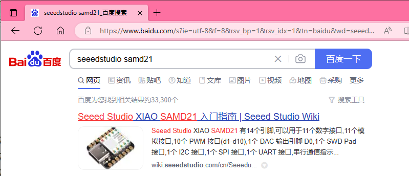

在此seeed官方提供的文档中，教你如何安装对应开发板包，跟着走即可，可见，现存大多教程，文档都是基于旧版1.xIDE的，在此使用2.xIDE，就会造成教程步骤不通的麻烦，而且，2.xIDE有时候在搜索库文件的时候都会出错，所以**务必使用1.xIDE**

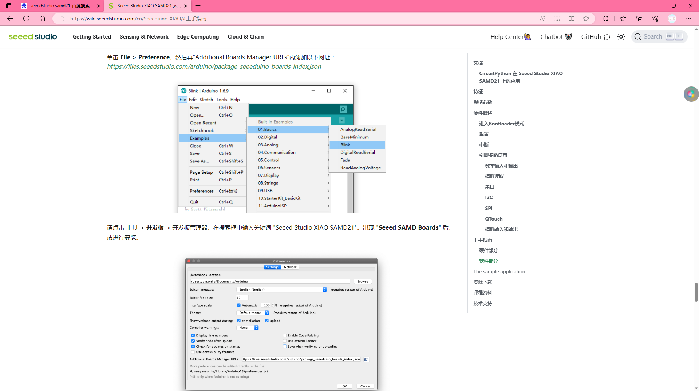

##### 库

本项目主要使用到[Adafruit_MPR121](https://github.com/adafruit/Adafruit_MPR121)这个库

需要安装库才能通过编译，否则编译失败，提示找不到"Adafruit_MPR121.h"

此库已进入Arduino IDE库管理器，可以直接通过库管理器安装  
  
  
安装即可使用，若提示还需一并安装其他库，一并安装即可


### 程序烧录

20寸以下可尝试Mai2TouchOK这个巨老程序，此程序没写区块分配，只能按照A-E 1-12顺序链接mpr和区块，此程序使用Touched一次性读取区块按下信息，刷新率巨高，1500hz，但是不建议用，这个程序如果不会自己改参数和测区块，完全不建议使用

20寸以上包括到43寸请使用newmap版本程序，此程序非常人性化，可以轻松调节哪个区块对应哪个mpr的哪个引脚，区块阈值可分别调节，非常的好用，缺点就是单独读取区块电极原始数据计算，速度较慢，SAMD21下140-160hz，32u4下100hz左右，但是也完全够用，不要担心，至少SAMD21已超过官方理论极限，100hz的32u4经过大佬测试打14+莫得问题

#### 来自xyqyear的贡献

应该是可用的，但是我还没测（主要是本人没有43寸设备）  
感谢xyqyear，为我们解决虚空触发的难题  
原文转述：

> 大佬您好，我在newmap的基础上把做了两个改进：
> 第一个是把 用原始数据计算是否被按下 改成了 使用touched直接读取触摸状态寄存器的方式。这种方式可以利用mpr121的去抖动功能，使得数据更加稳定，可以减少虚空触发。
第二个是我阅读了mpr121的所有官方文档，包括datasheet和AN3899,AN3890,AN3891,AN3892以及AN3944。把mpr121的各项配置参数单独列了出来，做成了一个头文件，并且加上了详细的注释以及这些信息可以在何处找到，修改了一部分我觉得可以优化的参数。  
>  
> 我用这个我修改了之后的程序之后就几乎完全解决了虚空触发的问题。您看有没有时间过目一下。  
>  
> https://github.com/xyqyear/maimaiTouchControl  


下载程序后，双击主ino打开即可  
在ide顶栏的[工具->开发板]选择你的开发板  
在ide顶栏的[工具->端口]选择对应的COM口，烧录即可

**注意注意**：如果是SAMD21等板，选择开发板后，可能出现其他可选项，如图
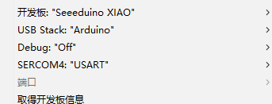  

这时候要随机应变，不同的板子弹出来的东西不一样，看好自己板子的特性，比如esp有不同内存大小等，选对，另外我们要使用USB-CDC串口的话，记得开USBCDC功能，像是SAMD21就直接选择好Arduino的USB Stack，esp32要选择CDC on boot打开之类。

部分板子如果编译不通过，可能需要
把
```#define SerialDevice Serial```
改成
```#define SerialDevice SerialUSB```

编译上传即可使用

上传好的使用方法：见[Sucareto/Mai2Touch](https://github.com/Sucareto/Mai2Touch)的Mai2Touch使用方法部分

## 第九部分 程序灵敏度和参数调试
## 第十部分 完成


## 编写时杂项（将会嵌入到上面的内容中）


[Q&A]


